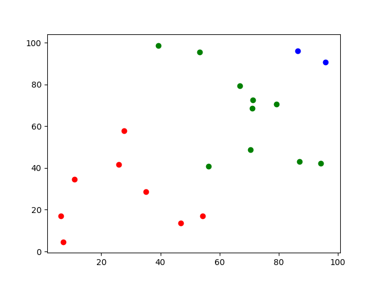
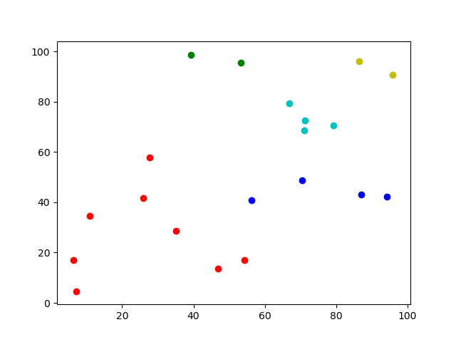
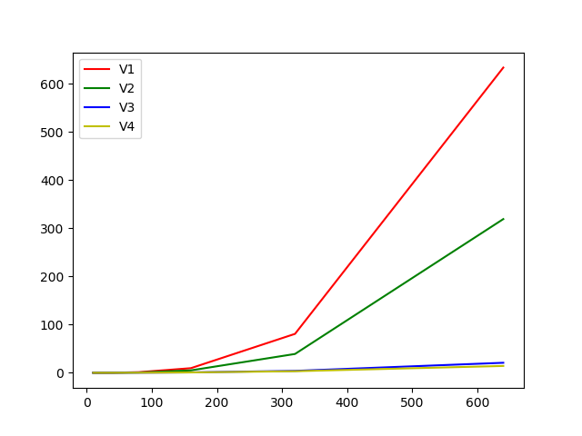

# SingleLinkageClustering

This is an experiment of different implementations for the *Single Linkage Clustering* algorithm in order to improve its performance applying different optimizations.

## Set up

Before to start with the implementation, we will describe what the project needs to run correctly.

### Dependencies

Although the project has been though to run without external implementations, we have used the matplotlib package to perform the plots.

This is a Python 3.6 project and uses the [Pipenv](https://docs.pipenv.org/) utility recommended by Python to manage the dependencies of the project. This tool's very easy of [install](https://docs.pipenv.org/#install-pipenv-today) and [use](https://docs.pipenv.org/basics/#environment-management-with-pipenv) it, and allows to build a Python work environment using the *Pipfile* and *Pipfile.lock* files included on the repository.

### Executions

On the repository, we have included 3 ways of executing the algorithm: test, run_example, and run_timing:

#### Test

Allows to run some simple test to check that all the version works correctly:
```
python tests.py
```

#### Run example

Allows running a simple example to test how the algorithm works. At the file start, we can configure some parameters to tune the execution. Finally, this execution produces a plot with the final clustering.
```
python run_example.py
```

#### Run timing

Allows running a timing comparison between the 4 implemented versions. At the file start, we can configure some parameters to tune the executions. Finally, this execution produces a plot with the final timing comparison.
```
python run_timing.py
```

## Implementation

This section contains the implementation details for all the versions and an explanation of the changes between all the versions.

### Base version

The base version is not a functional version itself, as the base version, we have to understand the base structure over which the others are based. This logic is contained in the *SingleLinkageClustering.py* file. On this file is implemented the initialization of the intern structures (*\_\_init\_\_*), the base algorithm (*clustering*), the computation of the distance between clusters (*distance_between_clusters*), and the combination of two clusters in a new one (*clusterize*).

Also, in this phase we have defined also some basic classes used to modulize the code:
* **Point**: Represents a d-dimensional point.
* **Cluster**: Represents a cluster of d-dimensional points.

### Version 1

This version corresponds to the *SingleLinkageClusteringV1.py* file. It implements a way of computing whose are the nearest clusters to combine them. As is the most basic version, to find the nearest clusters it checks all the possible combinations and takes the best. With this implementation, we have our first working version and we can run some clustering. Following images show some examples generated with the *run_example* script.

<p align="center">
</p>

### Version 2

This version corresponds to the *SingleLinkageClusteringV2.py* file. It improves the first version of the way of computing whose are the nearest clusters to combine them. Basically, we have modified the *nearest_clusters* method to avoid check the same pairs of clusters more than one time, comparing cluster1 with cluster2 and cluster2 with cluster1. With this implementation, we have a faster version of this clustering algorithm.

### Version 3

This version corresponds to the *SingleLinkageClusteringV3.py* file. It improves the second version reducing the number of distance computations performed on the algorithm. To achieve this, we have used a pre-computed distance matrix with the distances between all the clusters. This allows running all the algorithm without computing more distances than the computed on the algorithm initialization. To make this possible, we have included the *compute_distance_matrix* method to creating the distance matrix and we have adapted the *clusterize* method to keep this distance matrix coherent with the current clustering state.

### Version 4

This version corresponds to the *SingleLinkageClusteringV4.py* file. We have tried to apply some of the concepts used in *Locality-sensitive hashing* techniques to improve the algorithm. Concretely, we have used the concept of the bucket to avoid the full comparison between all the clusters to find the nearest neighbors. For this, we split the clusters into different buckets corresponding to a specific spatial zone of the full space. So, assuming that the nearest neighbors are always in the same bucket (we know that this is incorrect, but it's an approximation) we only find for the nearest neighbors between clusters on the same bucket. Also, using the improvement of the previous section, inside each bucket we have used a distance matrix to save some computations. Finally, when any bucket has more than one cluster, we consider that all the clusters are in the same bucket to follow the execution (equivalent to apply the algorithm without buckets).

## Comparision

Once the implementations are finished, we want to compare numerically the real improvement of the different versions. We have designed a very simple experiment to do this comparison:
* Geometrical space is fixed: 2-dimensional with coordinates between 0 and 100.
* Each case is replicated five times, and the computational times are the mean of these replications.
* The experiments are repeated for 7 number of points: 10, 20, 40, 80, 160, 320, 640.

So, the results of this experiment is reflected on the flowwing plot:
<p align="center"></p>

As we can hope, between the three first versions we can check a big improvement. But, for the last version, we can't appreciate a big improvement on the computation time. And, taking account that the last version works with buckets and the result is not the best, we can't consider an improvement with the fourth version.

## Conclusions and future work

With this project, I have had the opportunity to understand in deep the working of the *Single Linkage Clustering* algorithm. Implement an algorithm studied theoretically is a very good example of learn doing. And, although I have not applied completely the *Locality-sensitive hashing* in our algorithm, I tried to implement a very simplified idea of this and it doesn't work faster.

On another hand, I have a bad taste with this project because I have not achieved to implement a working version of the *Locality-sensitive hashing* optimization for our clustering algorithm. Beside of this, I have investigated this subject and I have caught the essence of this technique. But, for do a correct implementation, I have to understand it completely including all the parameters and the hashing functions in order to select the most appropriate ones.

So, the obvious future work of this project is to apply the *Locality-sensitive hashing* fully and check how it improves the computing time of the algorithm. Also, as it doesn't ensure an exact result, it can be interesting find for a quality measurement for the clustering and compare also the difference in clustering quality and the time computing. 

## References

1. [Single-linkage clustering](https://en.wikipedia.org/wiki/Single-linkage_clustering)
2. [Single Linkage Clustering Quiz - Georgia Tech - Machine Learning](https://www.youtube.com/watch?v=HfikjFVM3dg)
3. [E2LSH 0.1: User Manual](http://www.mit.edu/~andoni/LSH/manual.pdf)
4. [Nearest-Neighbor Methods in Learning and Vision: Theory and Practice - Introduction](http://people.csail.mit.edu/gregory/annbook/introduction.pdf)
